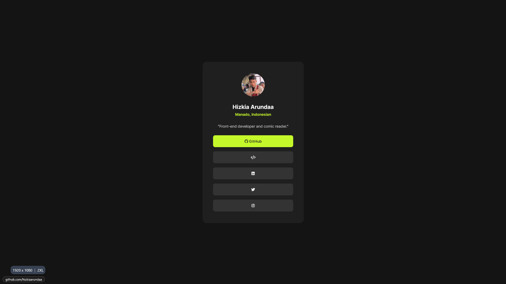

# Frontend Mentor - Social links profile solution

This is a solution to the
[Social links profile challenge on Frontend Mentor](https://www.frontendmentor.io/challenges/social-links-profile-UG32l9m6dQ).
Frontend Mentor challenges help you improve your coding skills by building realistic projects.

## Table of contents

- [Frontend Mentor - Social links profile solution](#frontend-mentor---social-links-profile-solution)
  - [Table of contents](#table-of-contents)
  - [Overview](#overview)
    - [The challenge](#the-challenge)
    - [Screenshot](#screenshot)
    - [Links](#links)
  - [My process](#my-process)
    - [Built with](#built-with)
  - [Author](#author)

## Overview

### The challenge

Users should be able to:

- See hover and focus states for all interactive elements on the page

### Screenshot

### Links

- Solution URL: [Github Repository](https://github.com/hizkiaarundaa/social-links-profile)
- Live Site URL: [Github Pages](https://hizkiaarundaa.github.io/social-links-profile)

## My process

### Built with

- Semantic HTML5 markup
- CSS custom properties
- Flexbox
- CSS Grid
- Mobile-first workflow
- [Font Awesome Icon](https://fontawesome.com/) - Icons Library

## Author

- Frontend Mentor - [@hizkiaarundaa](https://www.frontendmentor.io/profile/hizkiaarundaa)

